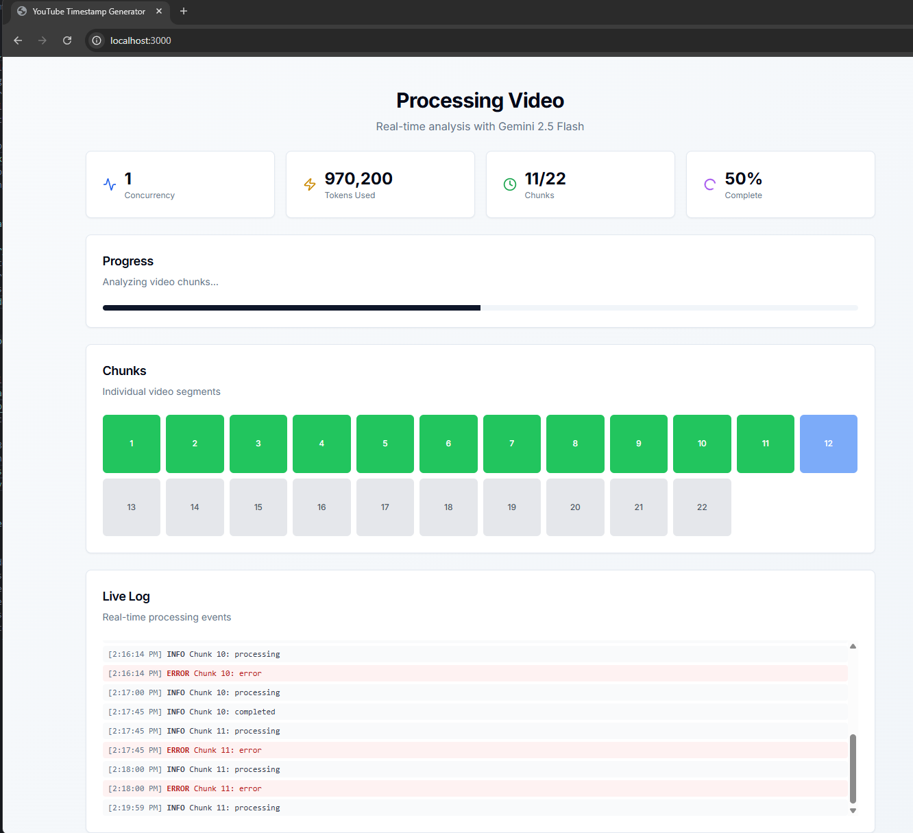
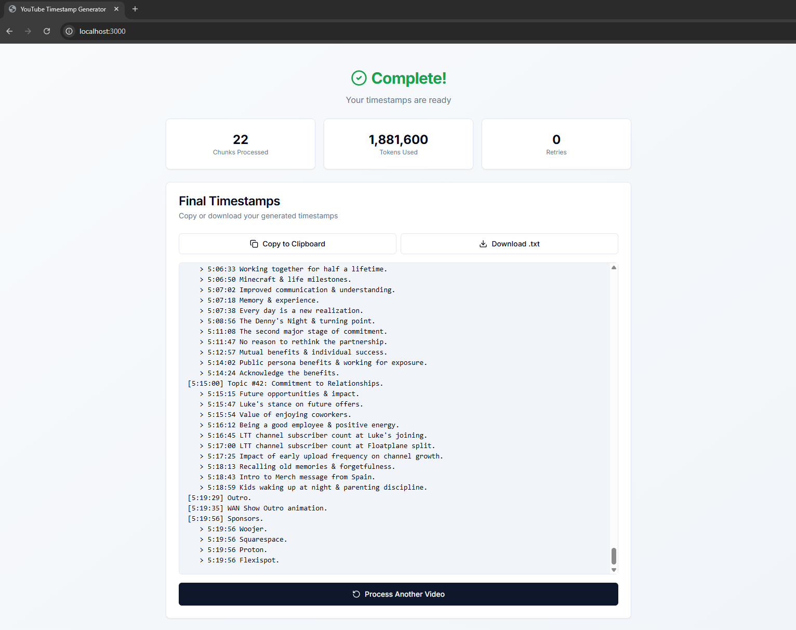

# YouTube Timestamp Generator

AI-powered tool to generate detailed, accurate timestamps for YouTube videos using Google's Gemini 2.5 Flash API.

## Features

- 🎯 **Accurate Timestamps**: Chunks videos intelligently with absolute timestamp generation
- ⚡ **Smart Rate Limiting**: Adaptive sliding window algorithm with automatic safety tuning
- 🔒 **BYOK (Bring Your Own Key)**: Client-side API key storage (sessionStorage/localStorage), no server-side data storage
- 📊 **Real-time Progress**: Live updates via Server-Sent Events
- 🎨 **Modern UI**: Built with Next.js 15, Tailwind CSS, and shadcn/ui
- 🐳 **Docker-First**: Single command to run, zero local installs required

## Demo

### Processing View

Real-time progress with intelligent rate limiting, chunk visualization, token usage tracking, and live event log:



### Results View

Processing complete! Final timestamps with statistics (chunks processed, tokens used, retries) ready to copy or download:



## Example Outputs

See real-world examples of generated timestamps. Click the video links to compare with the actual content:

---

> ⚠️ **NOTE:**
> In my experience using the video understanding capabilities of **Gemini 2.x** models, the transcription and overall video/audio understanding capacity of the model starts to go off the rails after about **15 minutes**.\
> **My recommendation:** Set the chunk size to **15 minutes** and sampling to **1 FPS**.\
> This is also the default behavior if you don't change anything.\
> This is based on my own experience and usage. I haven't done any extensive benchmarking, so your results may vary. Feel free to try different chunk sizes and settings to see what works best for you!\

---

### Example 1: WAN Show November 21, 2025 - [Watch Video](https://www.youtube.com/watch?v=Vzgimftolys)

A 5.5-hour extended episode with 55+ topics, deep technical discussions, and extensive merch message segments. [View Generated Timestamps →](examples/Vzgimftolys.txt)

**Sample output:**

```
[0:00] Chapters.
[0:19] Topic #1: Linus's iPhone Purchase for AirDrop becomes Obsolete with Pixel Announcement.
   > 0:51 AirPods Features on Android.
[1:03] Topic #2: Drama in the Pebble Community.
[1:39] Topic #3: Microsoft Kills Windows Activation Workaround; Linux Gains Traction.
```

> **Note**: This example was generated using settings: 15-minute chunks, low resolution, 1 FPS on the free tier.

### Example 2: WAN Show September 26, 2025 - [Watch Video](https://www.youtube.com/watch?v=TS1qrTc07v4)

A 2.5-hour episode with multiple topics, sponsors, and merch messages. [View Generated Timestamps →](examples/TS1qrTc07v4.txt)

**Sample output:**

```
[0:00] Intro.
[0:19] Topic #1: Introduction of Headline Topics.
[1:43] Sponsors.
   > 1:43 Corsair.
   > 1:43 Factor.
   > 1:43 Rove Lab.
[2:15] Topic #2: Amazon's $2.5 Billion Prime Subscription Settlement.
   > 3:23 FTC Action Against Amazon's Anti-Consumer Practices.
   > 4:09 EU regulations impacting global tech products.
```

> **Note**: This example was generated using settings: 25-minute chunks, low resolution, 0.5 FPS on the free tier.

### Example 3: WAN Show March 7, 2025 - [Watch Video](https://www.youtube.com/watch?v=dD6LgAWvn64)

A 2-hour episode with multiple topics, sponsors, and merch messages. [View Generated Timestamps →](examples/dD6LgAWvn64.txt)

**Sample output:**

```
Timestamps
[0:00] Chapters.
[0:59] Intro.
[1:19] Sponsors.
   > 1:19 Sponsor Shout-Outs (Animated).
   > 1:27 dbrand, Dell & Secretlab.
[1:45] Topic #1: NVIDIA RTX 5070 launch issues & performance.
[5:47] Topic #2: AMD Radeon 9070 & 9070 XT launch details & performance.
```

> **Note**: This example was generated using settings: 15-minute chunks, low resolution, 1 FPS on the free tier.

### Demonstrating Non-deterministic Behavior

### Example 3 (again): WAN Show March 7, 2025 - [Watch Video](https://www.youtube.com/watch?v=dD6LgAWvn64) (Re-roll)

I ran the process for the same video again. You can see that it's different but still fairly accurate. [View Generated Timestamps →](examples/dD6LgAWvn64-reroll.txt)

**Sample output:**

```
Timestamps
[0:02] Topic #1: Nvidia RTX 5070 & AMD Radeon 9070/XT GPU Launches.
   > 0:20 TechRadar article: Prebuilts are always superior (teaser).
   > 0:43 Mozilla Firefox ToU rewritten & Dig's return (teaser).
[0:59] Intro.
[1:17] Sponsors.
   > 1:26 Squarespace, Vessi, Corsair, dbrand, Dell & Secretlab.
[Cont.] Topic #1: Nvidia RTX 5070 & AMD Radeon 9070/XT GPU Launches.
   > 2:05 Nvidia RTX 5070 launch issues, performance & 12GB VRAM longevity concerns.
   > 5:47 AMD Radeon 9070/9070 XT launch reception & performance.
```

> **Note**: This example was generated using settings: 15-minute chunks, low resolution, 1 FPS on the free tier.


## Quick Start

### Prerequisites

- Docker and Docker Compose
- Gemini API Key ([Get one free](https://aistudio.google.com/app/apikey))

### Run the Application

```bash
# Clone the repository
git clone <your-repo-url>
cd youtube-timestamp-generator

# Start the app
docker compose up

# Open browser to http://localhost:3000
```

**First build**: 3-5 minutes (downloads dependencies, builds Next.js)
**Subsequent runs**: ~10 seconds (cached layers)

### Stop the Application

```bash
docker compose down
```

### Restart After Changes

After modifying code, prompts, or dependencies:

```bash
docker compose down
docker compose up --build
```

The `--build` flag rebuilds the image with your changes before starting.

## Usage

### 1. Enter API Key (First Time)

On first launch, you'll see an onboarding screen:

- Paste your Gemini API key
- Optionally check "Remember this key" to persist in localStorage
- Keys are validated server-side before use

### 2. Generate Timestamps

1. **Paste YouTube URL** - any public YouTube video
2. **Wait for duration to load** - automatic via YouTube IFrame API
3. **Configure settings** (optional) - click ⚙️ to adjust:
   - API Tier: Free (default), Tier 1, Tier 2, or Tier 3
   - Media Resolution: Low (96 tokens/sec at 1 FPS), Medium/High (288 tokens/sec at 1 FPS)
   - FPS: 0.2 - 2.0 (default: 0.5)
   - Chunk Size: 5-60 minutes (default: 25)
   - Concurrency Mode: Adaptive (recommended) or Manual
4. **Review token estimate** - live calculator shows bottleneck (TPM vs RPM) and estimated processing time
5. **Click "Generate Timestamps"**

### 3. Monitor Progress

Real-time updates via Server-Sent Events:

- **Rate Limiting**: Adaptive rate limiter ensures no 429 errors (TPM/RPM tracked in real-time)
- **Tokens Used**: Running count towards rate limits
- **Chunks**: Visual grid showing status (pending → processing → completed)
- **Live Log**: Detailed event stream with timestamps and retry information

### 4. Export Results

When processing completes:

- **Copy to Clipboard**: One-click copy button
- **Download as .txt**: Save to local file
- **Process Another**: Start a new video

## How It Works

### Architecture

```
┌─────────────┐
│   Browser   │  ← React UI (sessionStorage for API keys)
└──────┬──────┘
       │ Server Actions (validation, job creation)
       │ SSE (real-time updates)
       ↓
┌───────────────────────────────────────┐
│   Next.js Server (Docker)             │
│                                       │
│  ┌──────────┐   ┌─────────────┐       │
│  │  Server  │   │ API Routes  │       │
│  │ Actions  │   │ (Background)│       │
│  └────┬─────┘   └──────┬──────┘       │
│       │                │              │
│       │    ┌───────────▼────────────┐ │
│       │    │ Adaptive Rate Limiter  │ │
│       │    │  (Sliding Window TPM)  │ │
│       │    └───────────┬────────────┘ │
│       │                │              │
│       └────────────────┘              │
│                │                      │
└────────────────┼──────────────────────┘
                 ↓
        ┌────────────────┐
        │ Gemini 2.5 API │
        └────────────────┘
```

### Processing Pipeline

1. **Chunking**: Video divided into 25-minute segments (configurable)
   - Each chunk processed with `startOffset`, `endOffset`, and `fps` metadata
   - Gemini receives only the specific segment, not full video

2. **Analysis** (Parallel): Each chunk analyzed independently
   - Adaptive sliding window rate limiter proactively enforces TPM and RPM limits
   - Requests blocked until capacity available; actuals update window for accuracy
   - Structured output ensures valid JSON
   - Absolute timestamps calculated: `chunk_start + event_offset`
   - Retries on failures with exponential backoff (503, network errors)

3. **Consolidation**: All chunk results merged
   - Deduplicates events across chunk boundaries
   - Sorts chronologically (strict timestamp order)
   - Formats per style guide (Main Topics, Sub-points, Sponsors, Merch)

4. **Output**: Formatted timestamp document
   ```
   [0:00] Chapters.
   [1:42] Intro.
   [2:13] Topic #1: Main topic title.
      > 5:30 Specific sub-point or detail.
      > 7:45 Another sub-point.
   [9:18] Topic #2: Next main topic.
   ```

## Configuration

### Default Settings (Optimized for Free Tier)

- **Chunk Size**: 15 minutes (~86,400 tokens/chunk at 1 FPS low resolution)
- **Media Resolution**: Low (64 tokens/frame + 32 audio tokens/sec)
- **FPS**: 1.0 (1 frame per second)
- **API Tier**: Free (250K TPM, 10 RPM)
- **Model**: gemini-2.5-flash
- **Safety Buffer**: 20% on token estimates, 10% on limits (configurable)
- **Free Tier Throughput**: ~2 chunks in parallel (limited by TPM, not RPM)

### Environment Variables (Optional)

For self-hosting with a shared API key, create a `.env` file:

```bash
GEMINI_API_KEY=AIza...
NODE_ENV=production
PORT=3000
```

Or use docker-compose:

```yaml
services:
  web:
    environment:
      - GEMINI_API_KEY=${GEMINI_API_KEY}
```

### Rate Limits

Rate limits vary by model and tier. The app automatically configures limits based on your selection:

**gemini-2.5-flash:**
- Free: 10 RPM, 250K TPM, 250 RPD
- Tier 1: 1,000 RPM, 1M TPM, 10K RPD
- Tier 2: 2,000 RPM, 3M TPM, 100K RPD
- Tier 3: 10,000 RPM, 8M TPM, unlimited RPD

> **For complete rate limit details, see: [https://ai.google.dev/gemini-api/docs/rate-limits](https://ai.google.dev/gemini-api/docs/rate-limits)**

The app uses an **adaptive sliding window algorithm** to:

- **Proactively enforce** TPM and RPM limits (no 429 errors)
- **Maximize throughput** while staying within limits
- **Adapt safety margins** based on estimation vs actual token usage
- **Handle errors gracefully** with exponential backoff (503, network issues)
- **Apply configurable buffers** (20% on estimates, 10% on limits)

## Prompts

Two prompts power the AI analysis:

### 1. Chunk Analysis (`prompts/chunk_analysis_prompt.md`)

Analyzes individual video chunks:

- Extracts events with timestamps, types, titles, descriptions
- Uses `{{CHUNK_START_OFFSET}}` to calculate absolute timestamps
- Outputs structured JSON (validated with Zod schema)

### 2. Consolidation (`prompts/consolidation_prompt.md`)

Merges chunk results into final document:

- Deduplicates across boundaries
- Maintains strict chronological order
- Formats hierarchically (Main Topics → Sub-points)
- Applies style rules (e.g., group all Sponsors, number Topics)

You can customize prompts by editing the markdown files in `prompts/`. Changes take effect on next Docker build.

## Tech Stack

- **Framework**: Next.js 15 (App Router)
- **UI**: React 19, Tailwind CSS, shadcn/ui
- **State**: TanStack Query (React Query)
- **Rate Limiting**: Adaptive Sliding Window (custom implementation)
- **Queue**: p-queue
- **API**: Google Gemini 2.5 Flash/Pro
- **Schema Validation**: Zod (Structured Outputs)
- **Container**: Docker (multi-stage Alpine build)
- **Real-time**: Server-Sent Events (SSE)

## Project Structure

```
.
├── docker-compose.yml      # Single-command startup
├── Dockerfile              # Multi-stage production build
├── prompts/                # AI prompts (committed)
│   ├── chunk_analysis_prompt.md
│   └── consolidation_prompt.md
└── web/                    # Next.js application
    ├── src/
    │   ├── app/
    │   │   ├── actions/    # Server Actions (API key, job creation)
    │   │   ├── api/        # API Routes (SSE, background processing)
    │   │   ├── page.tsx    # Main UI
    │   │   └── layout.tsx
    │   ├── components/
    │   │   ├── feature/    # Main components
    │   │   └── ui/         # shadcn components
    │   ├── lib/
    │   │   ├── gemini.ts   # Gemini API client
│   │   ├── rate-limits/ # Adaptive rate limiter
│   │   │   ├── config.ts       # Rate limit configuration
│   │   │   ├── sliding-window.ts # Sliding window implementation
│   │   │   ├── adaptive-rate-limiter.ts # Dual-track adaptive limiter
│   │   │   └── processing-queue.ts # Queue with rate limiting
    │   │   ├── jobs.ts     # In-memory job manager
    │   │   └── process-video.ts  # Main processing logic
    │   ├── hooks/          # Custom React hooks
    │   └── types/          # TypeScript types
    ├── scripts/
    │   └── load-prompts.ts # Converts prompts to TypeScript
    └── package.json
```

## Development

### Development Mode (Hot Reload)

For active development with automatic file syncing:

```bash
docker compose watch
```

Code changes sync automatically without rebuild. Use this for rapid iteration.

> **Note**: For dependency changes, Dockerfile modifications, or prompt updates, use `docker compose up --build` instead.

### Add NPM Package

```bash
docker compose run --rm web npm install <package-name>
docker compose down
docker compose up --build
```

### View Logs

```bash
docker compose logs -f web
```

### Access Container Shell

```bash
docker compose exec web sh
```

## Troubleshooting

### Container Won't Start

```bash
# Check logs
docker compose logs web

# Rebuild from scratch (clears all cache)
docker compose down
docker compose up --build --no-cache
```

### API Key Invalid

- Verify key starts with `AIza`
- Check quota at [AI Studio](https://aistudio.google.com/)
- Ensure container has internet access

### Rate Limits

The app's adaptive sliding window algorithm minimizes rate limit errors:

- **Proactive limiting** - requests queued until capacity is available
- **Adaptive safety** - learns from actual vs estimated token usage
- **Real-time tracking** - UI shows TPM/RPM utilization

If processing feels slow:

- **Lower FPS** (reduces tokens per chunk)
- **Use low resolution** (64 vs 256 tokens/frame)
- **Smaller chunks** (more parallel requests within RPM limit)
- **Upgrade tier** (higher TPM/RPM limits)

> For details on official Gemini API rate limits, see: [https://ai.google.dev/gemini-api/docs/rate-limits](https://ai.google.dev/gemini-api/docs/rate-limits)\
> For full details on media resolution and how it impacts costs and limits, see: [https://ai.google.dev/gemini-api/docs/media-resolution](https://ai.google.dev/gemini-api/docs/media-resolution)

### Port 3000 Already in Use

Edit `docker-compose.yml`:

```yaml
ports:
  - "8080:3000" # Use port 8080 instead
```

### Timestamps Out of Order

This was a known issue and has been fixed:

- Chunk analysis now uses absolute timestamps
- Consolidation enforces strict chronological sorting
- If you still see issues, rebuild: `docker compose build --no-cache`

## Contributing

Contributions welcome! Please:

1. Fork the repository
2. Create a feature branch
3. Make your changes
4. Submit a pull request

## Support

- **Issues**: Open a GitHub issue
- **Questions**: Use GitHub Discussions
